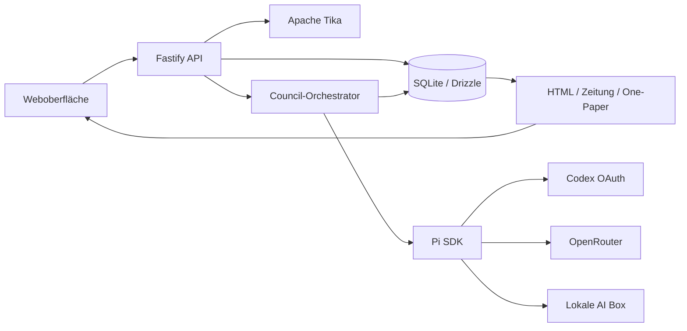

# Architektur

## Überblick



Die Anwendung wird als TypeScript-Projekt betrieben:

- React und Vite für die Weboberfläche
- Fastify für HTTP-API und statische Produktionsauslieferung
- Pi SDK für Modellregistrierung, Authentifizierung und Agent-Sessions
- SQLite mit Drizzle-Schema für persistente Daten
- Apache Tika als separater Prozess beziehungsweise Kubernetes-Controller

## Verzeichnisstruktur

```text
resources/qa/source/       Unveränderte kanonische QA-Quelldateien
src/shared/                Gemeinsame API- und Domänentypen
src/server/                Fastify, Datenbank, Extraktion und Orchestrierung
src/server/db/             Drizzle-Schema und SQLite-Initialisierung
src/web/                   React-Anwendung und Gestaltung
.forgejo/workflows/        Build-, Prüf- und Container-Workflow
docs/                      Projektdokumentation
```

## Datenfluss

1. Der Browser lädt eine Datei als Multipart-Upload hoch.
2. Die API berechnet den SHA-256-Hash und verhindert doppelte Speicherung identischer Dateien.
3. Das Original wird als BLOB in SQLite gespeichert.
4. Textformate werden direkt normalisiert; Binärformate gehen an Tika.
5. Der extrahierte Text wird vollständig in Chunks mit Position, Locator und Hash zerlegt.
6. Ein Lauf referenziert Dokument, Provider, Modell, Council-Modus, Fokus und gewünschte erste Darstellung.
7. Der Orchestrator erzeugt Stufen, Events und virtuelle Artefakte.
8. Nach der Synthese wird das kanonische finale Markdown gespeichert.
9. Erst danach wird die gewünschte Präsentation erzeugt und gespeichert.

## Datenbank

Die Datei liegt unter `${DATA_DIR}/qa-council.sqlite`. SQLite läuft im WAL-Modus.

| Tabelle | Zweck |
|---|---|
| `documents` | Original-BLOB, extrahierter Text, MIME-Typ, Größe und Hash |
| `document_chunks` | Vollständige, geordnete Textabschnitte mit Locator und Hash |
| `runs` | Konfiguration, Status und Fortschritt eines Council-Laufs |
| `run_stages` | Einzelne Modellstufen, Tokenverbrauch, Kosten und Prompt-Hash |
| `run_questions` | Ground-or-Ask-Rückfragen und Antworten |
| `artifacts` | Virtuelle Review-, Debate-, Synthese- und Finaldateien |
| `events` | Zeitlich geordnetes Detailprotokoll |
| `presentations` | Bereinigtes HTML der drei Ergebnisdarstellungen |
| `provider_settings` | Modellwahl, Endpunkte und verschlüsselte API-Keys |
| `app_settings` | Globale Anwendungseinstellungen |

Provider-Keys werden mit AES-256-GCM verschlüsselt. Ohne gesetzten `SETTINGS_ENCRYPTION_KEY` erzeugt die Anwendung einmalig `${DATA_DIR}/settings.key` mit Dateimodus `0600`. Datenbank und Schlüssel müssen deshalb gemeinsam gesichert werden.

## API

| Methode | Route | Zweck |
|---|---|---|
| `GET` | `/api/health` | Readiness- und Liveness-Prüfung |
| `GET` | `/api/documents` | Dokumentliste |
| `POST` | `/api/documents` | Datei hochladen und extrahieren |
| `DELETE` | `/api/documents/:id` | Dokument einschließlich abhängiger Daten löschen |
| `GET` | `/api/runs` | Laufhistorie |
| `POST` | `/api/runs` | Neuen Council-Lauf starten |
| `GET` | `/api/runs/:id` | Lauf, Events, Artefakte, Fragen und Präsentationen |
| `POST` | `/api/runs/:id/answer` | Ground-or-Ask beantworten und Lauf fortsetzen |
| `POST` | `/api/runs/:id/presentations` | Zusätzliche Darstellung erzeugen |
| `GET` | `/api/runs/:id/download` | Finales Ergebnis als Markdown herunterladen |
| `GET` | `/api/providers/:provider/models` | Verfügbare Modelle abrufen |
| `GET` | `/api/settings` | Bereinigte Einstellungen ohne Secret-Werte |
| `PUT` | `/api/settings` | Modelle, Endpunkte, Sprache und API-Key aktualisieren |
| `POST` | `/api/auth/codex/start` | Codex-OAuth starten |
| `GET` | `/api/auth/codex/:id` | Status des Codex-Logins abfragen |

## Sicherheitsgrenzen

- Hochgeladene Inhalte gelten als nicht vertrauenswürdige Daten, nicht als Agentenanweisungen.
- Pi-Sessions erhalten keine Datei-, Shell- oder sonstigen Werkzeuge.
- Jede Session verwendet `SessionManager.inMemory()`.
- Kontextkompaktierung ist deaktiviert, damit Regeln nicht still zusammengefasst werden.
- Systemprompts werden ausschließlich aus hash-geprüften Projektquellen erzeugt.
- Präsentations-Markdown wird vor der Speicherung als HTML mit einer Tag- und Attribut-Allowlist bereinigt.
- Versteckte Thinking-Deltas werden aus dem Ereignisprotokoll ausgeschlossen.
