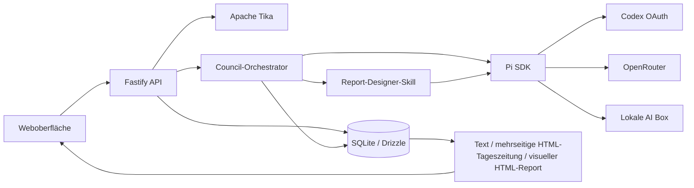

# Architektur

## Überblick



Die Anwendung wird als TypeScript-Projekt betrieben:

- React und Vite für die Weboberfläche
- Fastify für HTTP-API und statische Produktionsauslieferung
- Pi SDK für Modellregistrierung, Authentifizierung und Agent-Sessions
- SQLite mit Drizzle-Schema für persistente Daten
- Apache Tika als separater Prozess beziehungsweise Kubernetes-Controller

## Verzeichnisstruktur

```text
resources/qa/source/       Unveränderte kanonische QA-Quelldateien
resources/skills/          Hash-geprüfter Report-Designer-Skill
src/shared/                Gemeinsame API- und Domänentypen
src/server/                Fastify, Datenbank, Extraktion und Orchestrierung
src/server/db/             Drizzle-Schema und SQLite-Initialisierung
src/web/                   React-App-Shell, gemeinsame Webmodule und Gestaltung
src/web/components/        Eigenständige Haupt-, Detail- und Reader-Ansichten
src/web/lib/               API, Markdown-, Status- und Systemevent-Helfer
test/fixtures/             Kanonische lokale Test- und GUI-Dokumente
.forgejo/workflows/        Build-, Prüf- und Container-Workflow
docs/                      Projektdokumentation
```

## Datenfluss

1. Der Browser lädt eine Datei als Multipart-Upload hoch.
2. Die API berechnet den SHA-256-Hash und verhindert doppelte Speicherung identischer Dateien.
3. Das Original wird als BLOB mit dem Status `uploaded` in SQLite gespeichert. Beim Upload findet
   noch keine Extraktion statt.
4. Erst ein gestarteter Lauf eröffnet die sichtbare Stufe **Dokumentextraktion**. Textformate werden
   direkt normalisiert; Word wird nativ mit Tika strukturiert und einmalig in PDF umgewandelt.
5. Seitentext und JPEG-Rendering laufen als systemweit begrenzte Parallelpipeline. Maximal vier
   Codex-Seitenbeschreibungen laufen gleichzeitig; jede fertige Seite wird sofort in SQLite
   gesichert und nach Timeout einmal wiederholt.
6. Vollständige Extraktionen und erfolgreiche Seiten-Checkpoints werden über Dokument-Hash,
   Dateityp, Pipelineversion, Renderer-/Promptversion und Codex-Modell gecacht. Unterbrochene
   Extraktionsläufe werden nach einem Neustart aus den Checkpoints fortgesetzt.
7. Der extrahierte Text wird vollständig in Chunks mit Position, Locator und Hash zerlegt.
8. Ein Lauf referenziert Dokument, Provider, Modell, Council-Modus, Fokus und gewünschte erste Darstellung.
9. Der Orchestrator erzeugt Stufen, Events und virtuelle Artefakte.
10. Nach der Synthese wird das kanonische finale Markdown gespeichert.
11. Eine eigene, live sichtbare Pi-Stufe lädt den Report-Designer-Skill und erzeugt aus dem fachlich abgeschlossenen Ergebnis direkt ein HTML-Package mit mehrseitiger Tageszeitung, diagrammreichem Visual Report und Bildbriefing. Sie verwendet keinen Markdown-zu-HTML-Konverter.
12. Nach der fertigen Report-Antwort prüft der Server einmalig Transportstruktur, HTML-Verschachtelung, erforderliche Seiten und Hooks, das bekannte CSS-Klassenvokabular sowie verbotene JavaScript-Elemente und Attribute. Bei Befunden erhält derselbe Report-Agent den vollständigen Fehlerbericht und genau eine Korrekturrunde; anschließend folgt eine statische Nachprüfung.
13. Bei Codex und visionfähigen OpenRouter-Modellen rendert Chromium beide HTML-Ausgaben einmal als Screenshot. Eine sichtbare Vision-Stufe darf Hierarchie und Layout daraufhin einmal verbessern; eine weitere statische Vertragsprüfung entscheidet, ob die Revision übernommen wird. Lokale Modelle überspringen diesen Schritt.
14. Beide Designausgaben werden für jeden Lauf gespeichert. Die Textdarstellung rendert separat das kanonische Markdown.
15. Jeder neue Lauf kann ein dokumentbezogenes Editorialmotiv erzeugen: Codex über die native OpenAI-Bild-API, OpenRouter nativ bei bildfähigem Modell und sonst optional über ComfyUI, die AI Box optional über ComfyUI. Tageszeitung, Visual Report und PDF desselben Laufs verwenden gemeinsam dieses eine Motiv.
16. Ein Vergleich legt einen eigenen `comparisons`-Datensatz an und startet je erreichbarer Provider-/Modellwahl einen normalen, aber mit `comparison_id` isolierten Council-Lauf. `/api/runs` liefert diese Läufe bewusst nicht aus; sie werden ausschließlich über die Vergleichs-API und den Testmodus angezeigt.

## Datenbank

Die Datei liegt unter `${DATA_DIR}/qa-council.sqlite`. SQLite läuft im WAL-Modus.

| Tabelle | Zweck |
|---|---|
| `documents` | Original-BLOB, extrahierter Text, MIME-Typ, Größe und Hash |
| `document_chunks` | Vollständige, geordnete Textabschnitte mit Locator und Hash |
| `runs` | Konfiguration, Status und Fortschritt eines Council-Laufs |
| `run_attempts` | Unveränderliche Versuche mit Vorgänger und Wiedereinstiegsphase |
| `run_checkpoints` | Versionierte Phasen-Checkpoints mit Input-Hash und Output-Referenzen |
| `comparisons` | Gemeinsame Quelle und Konfiguration eines getrennten Providervergleichs |
| `run_stages` | Attemptgebundene Modellstufen, Tokenverbrauch, Kosten und Prompt-Hash |
| `run_questions` | Ground-or-Ask-Rückfragen und Antworten |
| `artifacts` | Virtuelle Review-, Debate-, Synthese- und Finaldateien |
| `events` | Attemptgebundenes, zeitlich geordnetes Detailprotokoll |
| `presentations` | Attemptgebundenes HTML einschließlich Zeitungs-Unterseiten |
| `tool_capability_probes` | 24-Stunden-Cache der Council-Tool-Probes |
| `provider_settings` | Modellwahl, Endpunkte und verschlüsselte API-Keys |
| `app_settings` | Globale Anwendungseinstellungen |

Provider-Keys werden mit AES-256-GCM verschlüsselt. Ohne gesetzten `SETTINGS_ENCRYPTION_KEY` erzeugt die Anwendung einmalig `${DATA_DIR}/settings.key` mit Dateimodus `0600`. Datenbank und Schlüssel müssen deshalb gemeinsam gesichert werden.

## API

| Methode | Route | Zweck |
|---|---|---|
| `GET` | `/api/health` | Readiness- und Liveness-Prüfung |
| `GET` | `/api/documents` | Dokumentliste |
| `POST` | `/api/documents` | Datei ohne sofortige Extraktion hochladen |
| `GET` | `/api/documents/:id` | Dokumentmetadaten und extrahierten Inhalt laden |
| `GET` | `/api/documents/:id/download` | Gespeichertes Original laden |
| `DELETE` | `/api/documents/:id` | Dokument einschließlich abhängiger Daten löschen |
| `GET` | `/api/runs` | Normale Laufhistorie ohne Vergleichsläufe |
| `POST` | `/api/runs` | Neuen Council-Lauf starten |
| `GET` | `/api/runs/:id?attempt=N` | Kleine Run-/Attempt-/Stage-/Datei-/Presentation-Summary |
| `GET` | `/api/runs/:id/activity?attempt=N&afterEventId=X` | Cursorbasiertes Live-Protokoll |
| `GET` | `/api/runs/:id/files?attempt=N&kind=…` | Dateimetadaten und Workflowphase |
| `GET` | `/api/runs/:id/files/:artifactId` | Lazy Dateiinhalt und sanitisiertes Markdown |
| `POST` | `/api/runs/:id/restart` | Fehlgeschlagenen Lauf atomar neu starten |
| `PUT` | `/api/runs/archive-all` | Alle fertigen und fehlgeschlagenen aktiven Läufe archivieren |
| `PUT` | `/api/runs/:id/archive` | Einzelnen Lauf archivieren oder wiederherstellen |
| `DELETE` | `/api/runs/:id` | Fehlgeschlagenen Lauf löschen |
| `POST` | `/api/runs/:id/answer` | Ground-or-Ask beantworten und Lauf fortsetzen |
| `GET` | `/api/comparisons` | Getrennte Providervergleiche mit ihren Läufen |
| `GET` | `/api/comparisons/:id` | Einen Vergleich direkt und reload-sicher laden |
| `POST` | `/api/comparisons` | Erreichbare Provider-/Modellkombinationen parallel starten |
| `POST` | `/api/runs/:id/presentations` | Zusätzliche Darstellung erzeugen |
| `GET` | `/api/presentations/:id` | Vollständiges Presentation-HTML und Seiten |
| `GET` | `/api/runs/:id/download` | Finales Ergebnis als Markdown herunterladen |
| `GET` | `/api/presentations/:id/pdf` | Visual Report als mehrseitiges PDF laden |
| `GET` | `/api/providers/:provider/models` | Verfügbare Modelle abrufen |
| `GET` | `/api/settings` | Bereinigte Einstellungen ohne Secret-Werte |
| `PUT` | `/api/settings` | Modelle, Endpunkte, Sprache und API-Key aktualisieren |
| `POST` | `/api/auth/codex/start` | Codex-OAuth starten |
| `GET` | `/api/auth/codex/:id` | Status des Codex-Logins abfragen |

## Sicherheitsgrenzen

- Hochgeladene Inhalte gelten als nicht vertrauenswürdige Daten, nicht als Agentenanweisungen.
- Fachreview-Sessions erhalten keine Datei-, Shell- oder sonstigen Werkzeuge.
- Strukturierte Supervisor-Sessions erhalten ausschließlich das jeweils erlaubte Submit-Tool.
- Report-Designer-Sessions erhalten ausschließlich isolierte `read`-/`edit`-Werkzeuge im
  temporären Report-Workspace.
- Jede Session verwendet `SessionManager.inMemory()`.
- Pi-Kontextkompaktierung ist aktiviert; jede fachliche Modellstufe bleibt eine eigene In-Memory-Session mit vollständig neu geladenen, hash-geprüften Skillregeln.
- Systemprompts werden ausschließlich aus hash-geprüften Projektquellen erzeugt.
- Tageszeitung und Visual Report werden vom Report-Designer direkt als HTML erzeugt. Der Server entfernt vor der Speicherung alle nicht erlaubten Tags und Attribute und ergänzt nur Navigation, stabile URLs und PDF-Hooks.
- Versteckte Thinking-Deltas werden aus dem Ereignisprotokoll ausgeschlossen.
