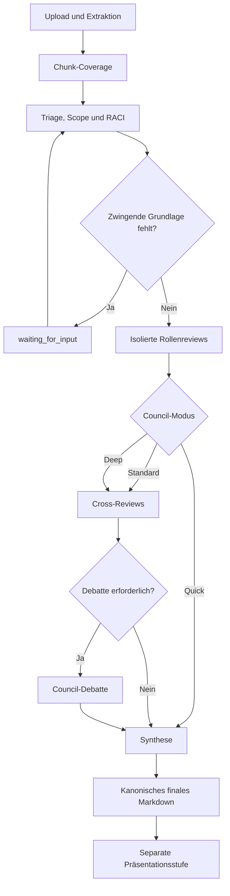

# Council-Workflow

## Kanonische Skill-Quellen

Die folgenden Dateien werden unverändert unter `resources/qa/source` verwaltet:

1. `00_README.md`
2. `01_QA-Architekt.md`
3. `02_Test-Manager.md`
4. `03_Test-Analyst.md`
5. `04_Test-Automation-Engineer.md`
6. `05_Tester.md`
7. `06_QA-Council.md`
8. `07_RACI-Team-Matrix.md`

Die Anwendung enthält für jede Datei den erwarteten SHA-256-Hash. `loadCanonicalSkills()` bricht ab, sobald eine Datei fehlt oder inhaltlich abweicht. Ein Test vergleicht zusätzlich die gelesenen Bytes mit der Datei und prüft alle 37 RACI-Zuordnungen einschließlich `4.1a`.

Die Quellen werden nicht durch eine KI-Zusammenfassung ersetzt. Rollenaufrufe erhalten README, Council-Regeln, RACI-Matrix und die vollständige jeweilige Rollenquelle. Synthese und Debatte erhalten alle acht Quellen.

## Verarbeitung großer Dokumente

Dokumente werden niemals über eine einfache Zeichenbegrenzung abgeschnitten.

- Jeder Chunk hat Position, Locator und SHA-256-Hash.
- Bis zu einer praktikablen Kontextgröße wird der vollständige Chunk-Text direkt übergeben.
- Bei großen Dokumenten wird jeder Chunk einzeln in eine Belegkarte überführt.
- Erst nach Verarbeitung aller Chunks arbeiten Rollen auf den Belegkarten.
- Das Coverage-Manifest enthält jeden Chunk und wird Teil des finalen Ergebnisses.
- Originaldatei, extrahierter Text und Chunks bleiben in SQLite erhalten.

Eine fachliche Prüfung darf einzelne Inhalte als nicht relevant bewerten. Sie darf Inhalte jedoch nicht deshalb überspringen, weil das Dokument zu lang war.

## Ablauf

## Triage und Ground-or-Ask

Die Triage bestimmt:

- Dokumenttyp und Scope
- Risikoprofil
- anwendbare RACI-Rollen
- empfohlenen Modus bei `Auto`
- fehlende, für eine belastbare Prüfung zwingend benötigte Information

Bei einer notwendigen Rückfrage wechselt der Lauf auf `waiting_for_input`. Die Frage erscheint im Detailpanel. Nach einer Antwort wird sie zusammen mit dem bisherigen Fokus erneut in die Triage eingespeist.

## Rollen

- QA-Architekt
- Test-Manager
- Test-Analyst
- Test-Automation-Engineer
- Tester

Jede Rolle arbeitet zunächst in einer eigenen Pi-Session. Sie sieht während des Einzelreviews keine
Antworten der anderen Rollen. Jeder wesentliche Befund soll einen Locator enthalten; der
KONFIDENZ-Block der jeweiligen Rollenvorlage ist Pflicht. Konsens wird nicht von den
Einzelreviewern bewertet, sondern anschließend aus den unabhängigen Cross-Review-Pässen
(`KONSENS-STAERKE: 1–5`, ungültig oder fehlend → 3) berechnet.

## Modi

### Quick

- mindestens zwei Rollen
- keine Cross-Reviews
- keine Debatte
- direkte Synthese aus Triage und Einzelreviews

### Standard

- mindestens drei anwendbare Rollen
- mindestens drei frische Cross-Review-Pässe; Rollenlabels werden zuvor zu `R1…Rn` anonymisiert
- Debatte nur bei durchschnittlicher Konsens-Stärke ab 4,0
- bei Debatte zwei sichtbare, sequenzielle Stufen: **Ankläger**, danach **Verteidiger** mit der
  Ankläger-Antwort als Input
- Chairman-Synthese plus eigener Dissens-Pass

### Deep

- alle fünf Rollen
- fünf frische, anonymisierte Cross-Review-Pässe
- getrennte Ankläger-/Verteidiger-Debatte wird immer durchgeführt
- zwei voneinander unabhängige Chairman-Stufen für Konsens- und Minderheitsfassung
- eigener Dual-Chairman-Dissens-Pass über beide Fassungen und das Rohmaterial

## Finales Ergebnis

Das kanonische finale Markdown enthält:

1. Finale Synthese
2. Triage, Scope und RACI
3. alle isolierten Einzelreviews
4. alle erzeugten Cross-Reviews
5. Debattenprotokoll oder nachvollziehbare Begründung, warum keine Debatte stattfand
6. vollständiges Chunk-Coverage-Manifest

Jede Modellantwort wird zusätzlich als virtuelles Artefakt gespeichert. Dazu gehören Provider, Modell, Prompt-Hash und die Hashes der verwendeten Skill-Quellen.

## Präsentationsstufe

Die Report-Design-Stufe startet erst nach Speicherung des finalen Artefakts. Sie lädt den
hash-geprüften `report-designer`-Skill und erzeugt Tageszeitung und Visual Report gemeinsam, direkt als
HTML. Nach dem fertigen Package läuft einmalig die statische HTML/CSS/JS-Prüfung und bei Bedarf
genau eine Agent-Korrekturstufe. `text` rendert separat das vollständige kanonische Markdown.

Die Verdichtung darf keine neuen Befunde oder Zahlen erfinden. Das finale Artefakt bleibt
unverändert und kann unabhängig von den Darstellungen heruntergeladen werden.
